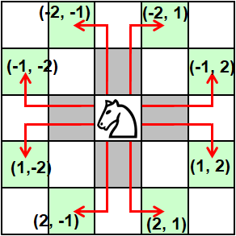

# 4. Knight's Tour
Solving the *Knight’s tour* problem involves finding a path that a Knight chess piece could use to visit every square on a chessboard without visiting any square twice. In the **open** version of the problem, the Knight can start and end on any square. In the **closed** version, the knight must finish so it could move back to its starting position in one more move to make a closed loop. This solution will make use of *recursion* and *backtracking* to search the problem space to identify solutions. The size of the search space is considerably reduced by the constraint that a piece may not visit the same space twice.
### Board and Move representation
The chessboard can be any size, but in this case we assume the standard **8 by 8** board, represented by a two dimensional Rust vector addressed as 8 rows each containing 8 columns. So, `board[0][0]` is the top left square and `board[1][0]` is the first square in the second row, while `board[1][7]` is the last square on the second row. The value stored at each vector position will be:
* `-1` to indicate that this position has not been visited, 
* `0` to indicate the initial starting position, or
* a value greater than zero, indicating the sequence (ie move number) when this square was visited.

Moves from the current position will be represented by a *row-column* offset (ie. a tuple), as shown in the diagram below:



Moves that result in vector slice indicies <0 or >7 (ie out of range) are not legal, as they are "off the edges of the board".
## Milestones
### 1. Add representational data structures
A new project `MLP/FSAwRust-2Recursion/m4-knight` was created and **geany** used to add the following code:
``` bash
[sysadmin@centos8s ~]$  cargo new MLP/FSAwRust-2-Recursion/m4-knight
     Created binary (application) `MLP/FSAwRust-2-Recursion/m4-knight` package
[sysadmin@centos8s ~]$ geany MLP/FSAwRust-2-Recursion/m4-knight/src/main.rs
use std::time::{Instant};

// The board dimensions.
const NUM_ROWS: usize = 8;
const NUM_COLS: usize = NUM_ROWS;
const INUM_ROWS: i32 = NUM_ROWS as i32;
const INUM_COLS: i32 = NUM_COLS as i32;

// Whether we want an open or closed tour.
const REQUIRE_CLOSED_TOUR: bool = false;

// Value to represent a square that we have not visited.
const UNVISITED: i32 = -1;
```
### 2. Create `main()` function
The following code was added:
``` rust
fn main() {
// Initialize the vector of move offsets [Row, Col].
    let mut offsets = [
        [-2, -1],
        [-1, -2],
        [ 2, -1],
        [ 1, -2],
        [-2,  1],
        [-1,  2],
        [ 2,  1],
        [ 1,  2],
    ];
// Create a NUM_ROWS x NUM_COLS vector with all entries Initialized to UNVISITED.
    let mut board = [[UNVISITED; NUM_COLS]; NUM_ROWS];
// Start at board[0][0].
    board[0][0] = 0;
// Try to find a tour.
    let start = Instant::now();
    let success = find_tour(&mut board, &mut offsets, 0, 0, 1);
    let duration = start.elapsed();
    println!("Time: {:?}", duration);
    if success {
        println!("Success!");
    } else {
        println!("Could not find a tour.");
    }
    dump_board(&mut board);
}
```
### 3. Create a `dump_board` function
The function `dump_board(board: &mut [[i32; NUM_COLS]; NUM_ROWS])` shown below, was added to the program:
``` rust
// Display the game board with each square containing sequence of visit
fn dump_board(board: &mut [[i32; NUM_COLS]; NUM_ROWS]) {
	for i in 0..NUM_ROWS {
		for j in 0..NUM_COLS {
			tens = board[i][j] / 10
			units = board[i][j] % 10
			print!("{}{} ", tens, units)
		}
		println!()
	}
}
```
### 4. Add the `find_tour` function
Given a board, list of moves, current position and number of moves completed, recursively find the next move and return `True` for **Open** tours where all squares have been visited, or where the next possible moves includes the original position for **Closed** tours; Otherwise return `False` to indicate that no solution has been found. The rust code for these functions is shown below:
``` rust
// Check that a proposed new board position is valid
// Retrun False if off-the-board
fn valid_move(new_row: i32, new_col: i32) -> bool{
	if 0 > new_row || new_row >= INUM_ROWS { return false }
	if 0 > new_col || new_col >= INUM_COLS { return false }
	return true
}

// Try to extend a knight's tour starting at (start_row, start_col).
// Return true or false to indicate whether we have found a solution.
fn find_tour(board: &mut [[i32; NUM_COLS]; NUM_ROWS],
    offsets: &mut [[i32; 2]; 8],  // 8 possible moves, 2 coordinates each.
    cur_row: i32, cur_col: i32,
    num_visited: i32) -> bool {
// have we traversed the entire board?
	if num_visited == INUM_ROWS * INUM_COLS {
		if REQUIRE_CLOSED_TOUR {  // does next moves a close the tour?
			for r_c_off in *offsets {
				let new_r = cur_row + r_c_off[0];
				let new_c = cur_col + r_c_off[1];
				if valid_move(new_r, new_c) && board[new_r as usize][new_c as usize] == 0 
					{ return true } // Yes
			}
			return false // No. Tour is not closed !
		}
		return true	// closed tour not required...
	}
// Tour is still incomplete... keep looking :-)
// Loop through the Knight move offsets to find a valid move
//	dump_board(board);   Uncomment this to see each try after backtrack
//	let x = get_i64("? ");
	for r_c_off in *offsets {
		let new_r = cur_row + r_c_off[0];	// form new position
		let new_c = cur_col + r_c_off[1];
		// skip if this move is off-board
		if !valid_move(new_r, new_c) { continue }
		// skip if this move is already visited
		if board[new_r as usize][new_c as usize] != UNVISITED { continue }
		board[new_r as usize][new_c as usize] = num_visited;	// mark this move as visited...
		if find_tour( board, offsets, new_r, new_c, num_visited + 1) {
			return true
		}
		// backtrack
		board[new_r as usize][new_c as usize] = UNVISITED;
	}
	return false
}
// START HERE
fn main() {
// Initialize the vector of move offsets [Row, Col].
    let mut offsets = [[-2, -1], [-1, -2], [ 2, -1], [ 1, -2],
        [-2,  1], [-1,  2], [ 2,  1], [ 1,  2]];
// Create a NUM_ROWS x NUM_COLS vector with all entries Initialized to UNVISITED.
    let mut board = [[UNVISITED; NUM_COLS]; NUM_ROWS];
// Start at board[0][0].
    board[0][0] = 0;
// Try to find a tour.
    let start = Instant::now();
    let success = find_tour(&mut board, &mut offsets, 0, 0, 1);
    let duration = start.elapsed();
    println!("Time: {:?}", duration);
    if success {
        println!("Success!");
    } else {
        println!("Could not find a tour.");
    }
    dump_board(&mut board);
}
```
### 5. Test run
The following command was entered to run the rust code:
``` bash
[sysadmin@centos8s ~]$ cd MLP/FSAwRust-2-Recursion/m4-knight/
[sysadmin@centos8s m4-knight]$ cargo run
   Compiling m4-knight v0.1.0 (/home/sysadmin/MLP/FSAwRust-2-Recursion/m4-knight)
    Finished dev [unoptimized + debuginfo] target(s) in 0.63s
     Running `target/debug/m4-knight`
Time: 150.566050497s
Success!
00 07 12 27 50 31 40 29 
11 04 09 32 39 28 51 48 
08 01 06 13 26 49 30 41 
05 10 03 58 33 38 47 52 
02 17 14 25 46 59 42 37 
21 24 19 16 57 34 53 60 
18 15 22 45 62 55 36 43 
23 20 63 56 35 44 61 54 
```
Note that better performance is achieved using the command:
``` bash
[sysadmin@centos8s m4-knight]$ cargo run --release
   Compiling m4-knight v0.1.0 (/home/sysadmin/MLP/FSAwRust-2-Recursion/m4-knight)
    Finished release [optimized] target(s) in 0.54s
     Running `target/release/m4-knight`
Time: 10.775110636s
Success!
00 07 12 27 50 31 40 29 
11 04 09 32 39 28 51 48 
08 01 06 13 26 49 30 41 
05 10 03 58 33 38 47 52 
02 17 14 25 46 59 42 37 
21 24 19 16 57 34 53 60 
18 15 22 45 62 55 36 43 
23 20 63 56 35 44 61 54 
```
## Resources
* [Knight’s tour](https://en.wikipedia.org/wiki/Knight%27s_tour)
* Futility Closet article [Warnsdorff’s Rule](https://www.futilitycloset.com/2014/11/10/warnsdorffs-rule/)
* 


(TBC)
